  <a href="https://rongzegao.com"><b>PERSONAL WEBSITE ↗</b></a> &nbsp; · &nbsp;
  <a href="./CV.md"><b>FULL CV</b></a> &nbsp; · &nbsp;
  <a href="./README.zh-CN.md">简体中文</a> &nbsp; · &nbsp;
  <a href="mailto:rgao28@jh.edu">Email</a> &nbsp; · &nbsp;
  <a href="https://www.linkedin.com/in/rongze-gao-09b488303/">LinkedIn</a>

## Hello, I’m Rongze — 高荣泽

**A researcher, an engineer, a student pilot, and a person who likes exploring how things work.** My story started in finance and quantitative modeling and grew into healthcare AI, intelligent agents and robotics. The code is part of that story—not all of it.

I completed my **M.S. in Information Systems & Artificial Intelligence at Johns Hopkins University** in August 2026. At [CDHAI’s AI Agent Lab](https://cdhai.carey.jhu.edu/ai-agent-lab/), I work with [Professor Gordon Gao](https://carey.jhu.edu/faculty/faculty-directory/gordon-gao-phd) on patient-data research and intelligent applications. Alongside the lab, I support U.S.-market robot deployment and maintenance at **Tuskrobots** through internship and part-time work.

Outside work, I’m drawn to **flying, FPV, robotics tinkering and games**. Some days curiosity leads to an agent runtime; other days, a flight lesson or an interactive world. I enjoy both the discipline of making something reliable and the excitement of trying something unfamiliar.

  
  
  
  
  

## ✈️ Beyond the terminal

| In the sky | In the workshop | In other worlds |
| :--- | :--- | :--- |
| **Student pilot** at Washington International Flight Academy, with **FAA Part 141 private-pilot training**. Flying brings procedure, spatial judgment and responsibility into the same cockpit. | **Robotics and FPV** let me explore the connection between software, sensors and the physical world. I like making things move, not just making them appear on a screen. | **Games and interactive worlds** are another place for curiosity, systems thinking and play. There is room here for interests that do not need to become a job title. |

[Explore my personal website](https://rongzegao.com) · [Play the web game](https://rongzegao.com/game.html) · [Private space](https://private.rongzegao.com)

## 🎓 Education & qualifications

| Institution | My background | Period |
| :--- | :--- | :--- |
| **Johns Hopkins University** | M.S. Information Systems & Artificial Intelligence · **Beta Gamma Sigma** | 2025–2026 |
| **Hangzhou City University / University of Waikato** | Dual Finance degrees: Bachelor of Economics & Bachelor of Business · **GPA 3.67/4.0** | 2021–2025 |
| **CQF Institute** | Certificate in Quantitative Finance · **Passed with Distinction** | 2023–2024 |
| **Washington International Flight Academy** | FAA Part 141 private-pilot course / flight training | Aviation |

At university, I also served as **debate team captain and class representative**. My graduate degree was conferred on August 29, 2026.

## 💼 Experience & the path so far

| Period | Work and contributions |
| :--- | :--- |
| **Jan 2026–Present** | **Research Assistant · Johns Hopkins CDHAI.** Patient time-series forecasting and medical-data agents; independently developed the VTA now in a Carey teaching pilot. Additional work includes Ospr.ai and AI-glasses embedded development. |
| **Feb 2025–Present** | **Engineering Intern / Part-time Engineer · Tuskrobots.** U.S.-market deployment, commissioning, troubleshooting and continuing robot-project maintenance. |
| **Sep 2025–Jan 2026** | **AI Specialist · Vital Guardian / JHU Ward Infinity.** Device-connected kidney-health monitoring and ML tools. Contributed to the [team awarded the $20,000 top prize](https://carey.jhu.edu/news/ward-infinity-makes-path-tech-minded-entrepreneurs-improve-public-health). |
| **Part-time / Remote** | **Research Consultant · WorldQuant BRAIN.** Alpha-factor exploration and out-of-sample analysis. |
| **Aug–Nov 2024** | **Venture Capital Analyst · 荷塘创业投资管理有限公司.** Evaluated eight medical-device investment opportunities. |
| **Jul–Aug 2024** | **Intern · Guotai Junan Securities.** Built a Python reporting tool covering **25 branches**; researched **23 listed companies**. |
| **Jun–Aug 2022** | **Intern · Minsheng Securities.** Financial-data analysis and organization. |

**[Read my complete CV →](./CV.md)** · **[中文完整履历 →](./CV.zh-CN.md)**

## 🏅 Research, competitions & milestones

**Kaggle Optiver — Bronze medal** · independently developed closing-price prediction models and compared ML methods before using LightGBM.

**WorldQuant Challenge 2024 — Gold Level** · alpha-factor research; International Quant Championship rank **1,178**.

**CFA Institute Research Challenge — Outstanding Investment Research** · led three teammates in company research and valuation, including **100,000 Monte Carlo simulations**.

**Publication**  
Gao, R. (2024). [*Trend Prediction Analysis of Shanghai Composite Index Based on LSTM Neural Network*](https://doi.org/10.54097/qw8hwy64). *Highlights in Business, Economics and Management, 24*, 409–416. Research conducted under Professor Peter Kempthorne.

**Research notes**  
[Distributed-agent continuity — bilingual research outline](./research/distributed-agent-continuity/).

## 🛠 A small corner of what I build

| Project | A brief introduction |
| :--- | :--- |
| [ANIMA](https://github.com/zeron-G/anima) / [ANIMA²](https://github.com/zeron-G/anima2) | Persistent agents with memory, controlled tools and cross-machine collaboration. **Private; demonstrations available.** |
| [Synapse](https://github.com/zeron-G/Synapse) | Shared-memory communication between Python, Rust and C++, with generated type definitions. |
| [HAPF](https://github.com/zeron-G/CDHAI-HAPF) | Research prototype for patient-adaptive glucose forecasting. |

More projects live in [my repositories](https://github.com/zeron-G?tab=repositories). They are one part of my life, alongside research, flight and everything I’m still curious about.

## 📈 Activity & contribution trail

Activity and trophy images are provided by external services; my [GitHub contribution page](https://github.com/zeron-G?tab=overview) remains the source when those services are unavailable.

---

<b>More than the things I build.</b>  <a href="https://rongzegao.com">Personal website</a> &nbsp; · &nbsp; <a href="./CV.md">Full CV</a> &nbsp; · &nbsp; <a href="mailto:rgao28@jh.edu">rgao28@jh.edu</a> &nbsp; · &nbsp; <a href="https://www.linkedin.com/in/rongze-gao-09b488303/">LinkedIn</a> Rongze Gao / 高荣泽 · Research, flight, curiosity.

