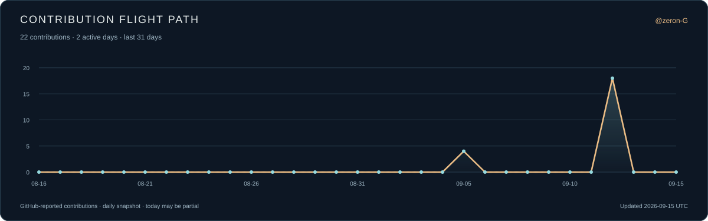
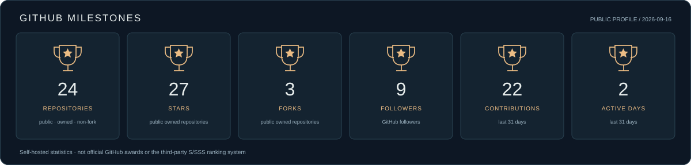

<a href="https://rongzegao.com/?lang=zh"><b>个人网站 ↗</b></a> &nbsp; · &nbsp; <a href="./CV.zh-CN.md"><b>完整履历</b></a> &nbsp; · &nbsp; <a href="./README.md">English</a> &nbsp; · &nbsp; <a href="mailto:rgao28@jh.edu">邮箱</a> &nbsp; · &nbsp; <a href="https://www.linkedin.com/in/rongze-gao-09b488303/">LinkedIn</a>

## 你好，我是高荣泽

**研究者、工程师、飞行员学员，也是一个喜欢探索事物如何运作的人。** 我的起点是金融与量化建模，后来逐渐走向医疗 AI、智能体和机器人。代码是这段经历的一部分，但不是我的全部。

2026 年 8 月，我完成了**约翰斯·霍普金斯大学信息系统与人工智能硕士**学业。目前在 [CDHAI AI Agent Lab](https://cdhai.carey.jhu.edu/ai-agent-lab/) 跟随 [Gordon Gao 教授](https://carey.jhu.edu/faculty/faculty-directory/gordon-gao-phd) 参与患者数据研究和智能应用开发，也以实习、兼职形式支持**塔斯克机器人美国市场项目的部署与维护**。

工作之外，我喜欢**飞行、FPV、折腾机器人和游戏**。好奇心有时通向一套智能体系统，有时通向一次飞行训练，或者一个可以探索的虚拟世界。我既喜欢把事情做可靠的严谨，也喜欢尝试陌生事物的兴奋。

    

## ✈️ 从终端到天空

| 在天空中 | 在工作台边 | 在另一个世界里 |
| :--- | :--- | :--- |
| **飞行员学员**，在 Washington International Flight Academy 接受 **FAA Part 141 私人飞行员课程训练**。飞行把程序、空间判断与责任放进同一个驾驶舱。 | **机器人与 FPV** 让我探索软件、传感器和真实世界之间的联系。我喜欢让东西真正动起来，而不只是出现在屏幕上。 | **游戏与交互世界** 是好奇心、系统思维和玩心的另一个出口。不是每一种兴趣都需要成为一个工作头衔。 |

[进入个人网站](https://rongzegao.com/?lang=zh) · [玩一下网页游戏](https://rongzegao.com/game.html) · [进入私域](https://private.rongzegao.com)

## 🎓 教育与资格

| 学校／机构 | 背景 | 时间 |
| :--- | :--- | :--- |
| **约翰斯·霍普金斯大学** | 信息系统与人工智能理学硕士 · **Beta Gamma Sigma 会员** | 2025–2026 |
| **浙大城市学院／怀卡托大学** | 金融学双学位：经济学学士、工商管理学士 · **GPA 3.67/4.0** | 2021–2025 |
| **CQF Institute** | 量化金融分析师 · **Passed with Distinction** | 2023–2024 |
| **Washington International Flight Academy** | FAA Part 141 私人飞行员课程／飞行训练 | 航空 |

大学期间也担任过**辩论队队长与学习委员**。硕士学位授予日期为 2026 年 8 月 29 日。

## 💼 我的经历

| 时间 | 工作与贡献 |
| :--- | :--- |
| **2026.01–至今** | **JHU CDHAI 研究助理**：患者时序预测、医疗数据智能体；独立开发进入 Carey 学院试点的 VTA，另参与 Ospr.ai 与 AI 眼镜嵌入式相关研发。 |
| **2025.02–至今** | **塔斯克机器人工程师（实习／兼职）**：美国市场项目部署、调试、技术排障与持续维护。 |
| **2025.09–2026.01** | **Vital Guardian／JHU Ward Infinity AI 专家**：设备连接的肾脏健康监测与 ML 工具；参与团队获得 [20,000 美元最高奖](https://carey.jhu.edu/news/ward-infinity-makes-path-tech-minded-entrepreneurs-improve-public-health)。 |
| **兼职／远程** | **WorldQuant BRAIN 研究顾问**：Alpha 因子探索与样本外分析。 |
| **2024.08–2024.11** | **荷塘创业投资管理有限公司风险投资分析师**：评估八个医疗器械投资项目。 |
| **2024.07–2024.08** | **国泰君安证券实习生**：自主开发覆盖 **25 家分支机构**的 Python 报告工具，研究 **23 家上市公司**。 |
| **2022.06–2022.08** | **民生证券实习生**：财务数据分析与整理。 |

**[阅读完整中文履历 →](./CV.zh-CN.md)** · **[English CV →](./CV.md)**

## 🏅 研究、竞赛与里程碑

**Kaggle Optiver 铜牌**：独立建立收盘价格预测模型，比较机器学习方法后采用 LightGBM。

**2024 WorldQuant Challenge Gold Level**：Alpha 因子研究；International Quant Championship 排名 **1,178**。

**CFA Institute Research Challenge 优秀投资研究奖**：带领三位队员开展公司研究与估值，包括 **100,000 次蒙特卡洛模拟**。

**论文**  
Gao, R. (2024). [*Trend Prediction Analysis of Shanghai Composite Index Based on LSTM Neural Network*](https://doi.org/10.54097/qw8hwy64). *Highlights in Business, Economics and Management, 24*, 409–416。在 Peter Kempthorne 教授指导下开展相关研究。

**研究笔记**  
[分布式智能体存在连续性：中英文研究大纲](./research/distributed-agent-continuity/)。

## 🛠 我做的东西，只占这里的一角

| 项目 | 一句话介绍 |
| :--- | :--- |
| [ANIMA](https://github.com/zeron-G/anima)／[ANIMA²](https://github.com/zeron-G/anima2) | 有记忆、受控工具执行与跨机协作的持续智能体。**私有，可演示。** |
| [Synapse](https://github.com/zeron-G/Synapse) | 连接 Python、Rust、C++ 的共享内存通信与类型生成组件。 |
| [HAPF](https://github.com/zeron-G/CDHAI-HAPF) | 患者个体化血糖预测研究原型。 |

更多作品在[仓库列表](https://github.com/zeron-G?tab=repositories)里。它们与研究、飞行和仍在探索的兴趣一起，构成我的生活。

## 📈 活动与贡献轨迹

贡献图与奖杯风格统计卡由本仓库每日生成，数据来自 GitHub；卡片显示实际统计，不代表 GitHub 官方奖项。刷新失败时保留上次成功的快照。

---

<b>我不只是我做过的项目。</b>  <a href="https://rongzegao.com/?lang=zh">个人网站</a> &nbsp; · &nbsp; <a href="./CV.zh-CN.md">完整履历</a> &nbsp; · &nbsp; <a href="mailto:rgao28@jh.edu">rgao28@jh.edu</a> &nbsp; · &nbsp; <a href="https://www.linkedin.com/in/rongze-gao-09b488303/">LinkedIn</a> 高荣泽 / Rongze Gao · 研究、飞行、好奇心。

