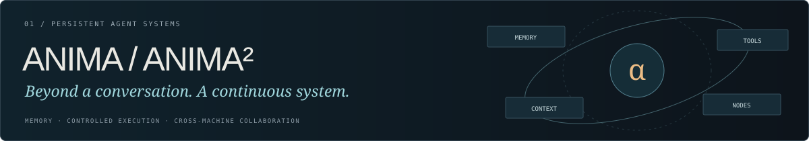
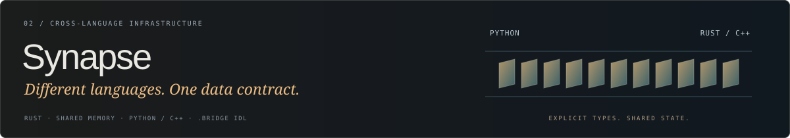

<a href="https://rongzegao.com/?lang=zh"><b>探索个人作品集 ↗</b></a> &nbsp; · &nbsp; <a href="./README.md">English</a> &nbsp; · &nbsp; <a href="mailto:rgao28@jh.edu">邮箱</a> &nbsp; · &nbsp; <a href="https://www.linkedin.com/in/rongze-gao-09b488303/">LinkedIn</a>

 

## 01 / 把想法，做成系统

我是 **高荣泽 / Rongze Gao**，约翰斯·霍普金斯大学信息系统与人工智能硕士，关注**持续运行的智能体、医疗 AI 与系统工程**。在 [CDHAI](https://cdhai.carey.jhu.edu/ai-agent-lab/)，跟随 [Gordon Gao 教授](https://carey.jhu.edu/faculty/faculty-directory/gordon-gao-phd)研究患者数据分析和个体化预测；在实验室之外，开发智能体运行时和跨语言基础组件，并以实习、兼职形式支持塔斯克机器人美国市场项目。

**模型只是系统的一部分。** 我同样关心数据怎样进入系统、工具怎样执行、失败怎样恢复，以及结果能否被独立验证。

 

## 02 / 精选系统

### ANIMA / ANIMA² · 不止一次对话，而是持续工作

独立开发 ANIMA 模块化智能体框架，并基于部署和故障处理经验重构 ANIMA²。以**异步 Python 内核、React/TypeScript Web、Textual 终端与 SQLite WAL**构成统一运行时。

- **状态连续性：**持久化会话、带来源的记忆和执行记录；支持纠错与遗忘。工具按需加载，大结果归档为带哈希的产物，压缩上下文后仍能精确回查原始证据。
- **受控执行：**实现执行审批、权限撤销、带哈希前置条件的原子编辑与进程树取消；插件通过进程级契约测试后进行版本化激活或回滚，不依赖内核自修改。
- **跨机协作：**实现 SSH 节点发现、并行委派、产物回传和显式记忆同步冲突处理；记录 Windows/Linux 上协调者与两个模型工作节点的实际协作。
- **任务验收：**用未修改的测试检查代码修复，核对真实浏览器表单提交与断线恢复。9 月 9 日记录包含 216 项 Python 测试、30 项 Web 单元测试和 15 项浏览器场景；不是排行榜性能声明。

[项目详情 ↗](https://rongzegao.com/?lang=zh#project/anima-family) · [ANIMA · 私有](https://github.com/zeron-G/anima) · [ANIMA² · 私有](https://github.com/zeron-G/anima2) · [验收记录](https://github.com/zeron-G/anima2/blob/main/specs/001-anima2/verification.md)

 

### Synapse · 不同语言，同一份数据契约

为 Python AI 进程与 C++/Rust 原生应用开发 **Rust 共享内存通信层**，在保留进程边界的同时统一类型定义、通信与退出行为。

- 实现双向 **SPSC 环形缓冲区**，封装 Linux POSIX 共享内存与 Windows 文件映射，提供 Python 原生/mmap 路径和 C++ 头文件客户端。
- 开发 **.bridge 接口描述语言**的词法分析、语法解析、C ABI 布局计算与三语言代码生成；从单一 schema 生成 Rust 结构体、Python ctypes 和带布局断言的 C++ 定义。
- 实现类型化通道、**seqlock 最新值槽**、可配置等待、心跳与对端退出检测、优雅关闭和资源清理，补充通信往返、类型布局与异常路径测试。

[项目详情 ↗](https://rongzegao.com/?lang=zh#project/synapse) · [公开源码](https://github.com/zeron-G/Synapse) · [基准方法](https://github.com/zeron-G/Synapse/blob/main/benchmarks/README.md)

 

### HAPF 与患者研究智能体 · 先有证据，再有表达

在 CDHAI 开发个体化血糖预测研究流程，将**群体训练、患者低秩适配、不确定性校准和群体模型回退**连接起来，研究未来 30/60 分钟血糖预测。

- 构建因果 TCN 与受试者级时间隔离评估，避免同一患者不同记录或未来观测泄漏到训练过程。
- 完成 **12 名 CGM 受试者**探索性留一评估，12 折中 6 折采用个体化；小样本结果不构成临床有效性结论。
- 在 **CDHAI_June** 中实现患者文件读取、确定性统计、假设检验、证据台账与 LLM 报告，接入 HAPF 并跨轮保存和复用分析产物。

[HAPF 详情 ↗](https://rongzegao.com/?lang=zh#project/hapf) · [模型仓库](https://github.com/zeron-G/CDHAI-HAPF) · [实验与限制](https://github.com/zeron-G/CDHAI-HAPF/blob/main/docs/proof_of_concept.md) · [患者数据智能体](https://github.com/zeron-G/CDHAI_June)

> 私有仓库链接仍需访问权限，可联系我进行项目演示。医学项目为研究原型，不作为诊断产品或胰岛素剂量系统；测试和性能信息应结合原始记录中的范围与条件阅读。

 

## 03 / 更多实践

| 项目 | 具体工作 | 阶段与归属 |
| :--- | :--- | :--- |
| [VTA 虚拟教学助手](https://rongzegao.com/?lang=zh#project/vta) | 独立将教学需求实现为可运行的教学辅助应用 | Carey 学院教学试点 |
| [PiDog / embodied-robot](https://rongzegao.com/?lang=zh#project/pidog) | 现有硬件上的分层控制、语音交互与远端 AI 集成 | 个人硬件原型 · 私有 |
| [mech / 身外化身](https://github.com/zeron-G/mech) | 主动外骨骼架构、传感边界与分阶段安全验证路线 | 规划与技术预研 |
| [Kinsoul / SoulPack](https://rongzegao.com/?lang=zh#project/kinsoul) | 持续人格、记忆产品与可迁移状态语义 | 产品原型／格式草案 |
| [Alpha Research Agent](https://github.com/zeron-G/worldquant-alpha-research-agent) | 因子探索、仿真、稳健性与受控提交 | 研究自动化，不是实盘收益 |
| [FinRAG Agent](https://github.com/zeron-G/FinRAG-Agent) | 10-K 章节检索、流式回答与引用追踪 | JHU 课程团队项目 |
| [Black Hole Renderer](https://github.com/zeron-G/blackhole-sim) | Schwarzschild 光线追踪、引力透镜与吸积盘可视化 | 个人数值与视觉实验 |

[查看完整项目索引 ↗](https://rongzegao.com/?lang=zh#work)

 

## 04 / 工作与研究经历

| 时间 | 工作 |
| :--- | :--- |
| **2026.01—至今** | **研究助理 · JHU CDHAI**：患者预测与研究智能体；独立开发进入 Carey 教学试点的 VTA。 |
| **2025.02—至今** | **工程师（实习／兼职）· 塔斯克机器人**：美国市场机器人部署、调试、排障和持续维护。任期包含实习及兼职项目支持，不表示全程全职。 |
| **2025.09—2026.01** | **AI 专家 · Vital Guardian / JHU Ward Infinity**：设备连接的肾脏健康监测与 ML 工具；参与[团队获 20,000 美元最高奖](https://carey.jhu.edu/news/ward-infinity-makes-path-tech-minded-entrepreneurs-improve-public-health)。 |
| **兼职／远程** | **研究顾问 · WorldQuant BRAIN**：Alpha 因子研究与样本外分析。 |

<b>早期行业经历</b>

**荷塘创业投资管理有限公司 · 2024.08—2024.11**  
评估八个医疗器械投资项目，通过路演、创业团队沟通和财务／技术分析支持投资筛选。

**国泰君安证券 · 浙江分公司 · 2024.07—2024.08**  
自主开发并推广 Python 工具，自动抓取和处理 **25 家分支机构**业务报告，研究 **23 家上市公司**。

**民生证券 · 浙江分公司 · 2022.06—2022.08**  
开展财务数据分析与整理，为后续建模和自动化工作建立业务背景。

 

## 05 / 教育、发表与荣誉

| 院校 | 学位／资格 |
| :--- | :--- |
| **约翰斯·霍普金斯大学 · 2025—2026** | 信息系统与人工智能理学硕士；2026 年 8 月 29 日获学位；**Beta Gamma Sigma** 会员 |
| **浙大城市学院／怀卡托大学 · 2021—2025** | 金融学双学位：经济学学士、工商管理学士；**GPA 3.67/4.0** |
| **CQF Institute · 2023—2024** | Certificate in Quantitative Finance；**Passed with Distinction** |

**学术发表**  
Gao, R. (2024). [*Trend Prediction Analysis of Shanghai Composite Index Based on LSTM Neural Network*](https://doi.org/10.54097/qw8hwy64). *Highlights in Business, Economics and Management, 24*, 409–416.

**竞赛荣誉**  
Kaggle Optiver **铜牌** · 2024 WorldQuant Challenge **Gold Level** · CFA Research Challenge **优秀投资研究奖**。

**研究笔记**  
[分布式智能体连续性：中英文研究大纲](./research/distributed-agent-continuity/)——探索性研究思路，与正式学术发表区分。

 

## 06 / 终端之外

在 **Washington International Flight Academy** 接受 FAA Part 141 私人飞行员课程训练，也喜欢机器人实践与互动世界。飞行中的程序意识、空间判断与责任感，是我在工程之外持续练习的另一种系统思维。训练背景不等于已经取得飞行员执照。

[进入互动网页游戏 ↗](https://rongzegao.com/game.html) · [阅读完整个人背景 ↗](https://rongzegao.com/?lang=zh#profile)

代码贡献轨迹

 

---

<b>一起构建有意义的事物。</b>  <a href="mailto:rgao28@jh.edu">rgao28@jh.edu</a> &nbsp; · &nbsp; <a href="https://rongzegao.com/?lang=zh">rongzegao.com ↗</a> 高荣泽 / Rongze Gao · Observatory 2026 · 私有源码仍需授权。

